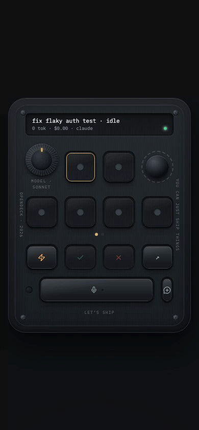
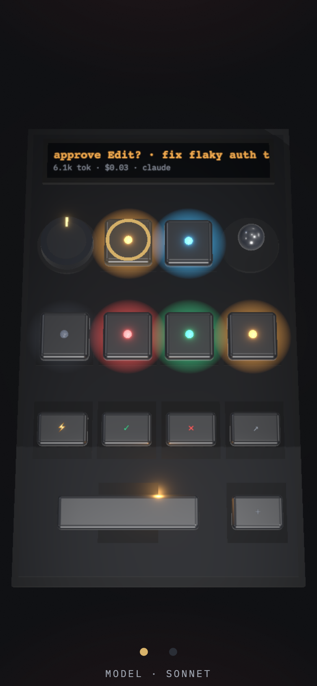
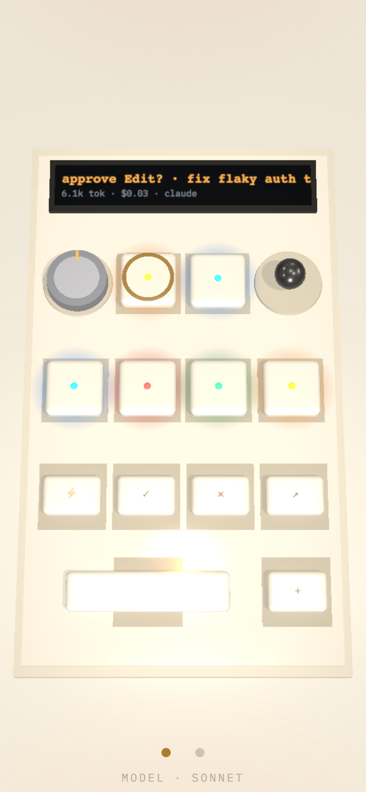
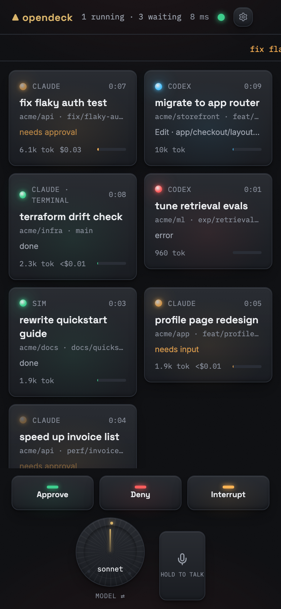
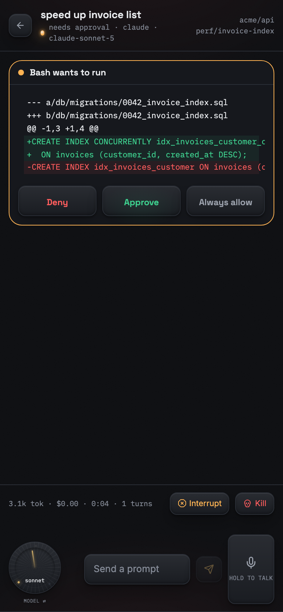
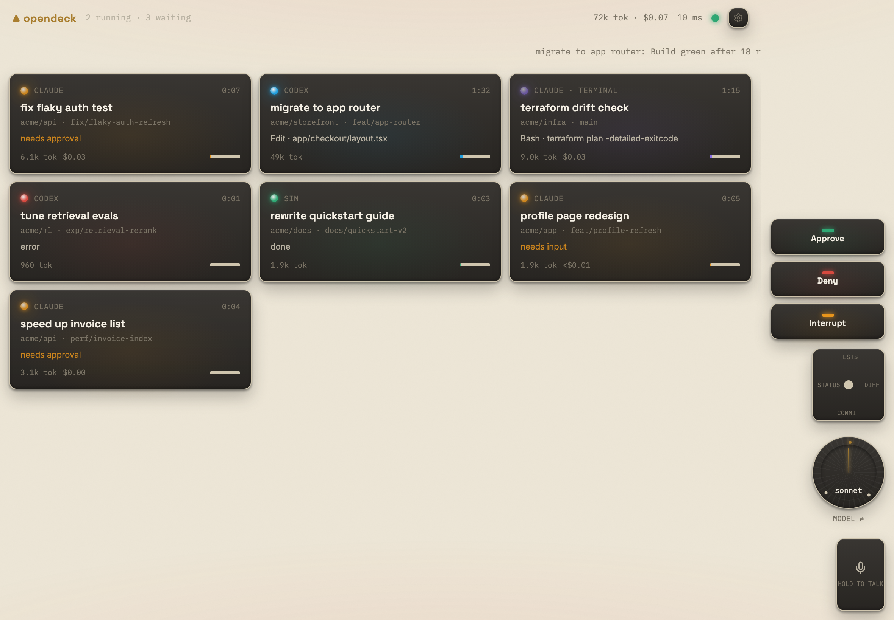
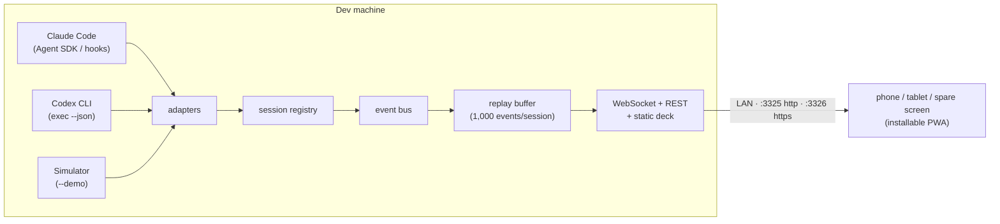

<h1 align="center">▲ OpenDeck</h1>

<p align="center"><strong>An open-source digital micropad for agentic work.</strong></p>

<p align="center">
  Turn any phone, tablet, or spare screen into a zero-lag, physical-feeling
  control deck for Claude Code and Codex — glanceable live status, tactile
  controls, one-tap approvals. No hardware to buy.
</p>

<p align="center">
  
</p>

## 30-second quickstart

All you need is Node 20+ on the machine your agents run on:

```sh
npx opendeck
```

Scan the QR code the hub prints with your phone. That's it — the page pairs
itself, installs as a PWA if you want it to, and your agents show up as
backlit tiles. No agents running yet? See the whole thing in motion first:

```sh
npx opendeck --demo
```

Starting is idempotent — a new `opendeck` politely takes the port over
from an old one — and `opendeck stop` / `opendeck status` manage the
running hub from any terminal.

## Why this instead of plastic

OpenAI's Codex Micro sells two real things: ambient glanceable status and
one-press tactile control. It's $230, it's six keys, and it only speaks Codex.

|             | OpenDeck                                                                                                                                                                           | Codex Micro            |
| ----------- | ---------------------------------------------------------------------------------------------------------------------------------------------------------------------------------- | ---------------------- |
| Price       | $0, MIT-licensed                                                                                                                                                                   | $230, limited run      |
| Agents      | Unlimited tiles                                                                                                                                                                    | 6 RGB keys             |
| Status      | Color + harness, repo/branch, elapsed, current tool, cost                                                                                                                          | Color                  |
| Approvals   | The actual command or unified diff, one tap                                                                                                                                        | A blinking key         |
| Harnesses   | Claude Code + Codex now; one adapter interface for more                                                                                                                            | Codex                  |
| Controls    | Bindable action keys, dial with detents, jog pad, voice key                                                                                                                        | 13 keys, dial, stick   |
| Device mode | **The default**: a real-time WebGL device — clearcoat keycaps over glowing LEDs, knurled reasoning knob (minimal→xhigh), sprung joystick, e-ink readout, bloom and studio lighting | The real thing (fair!) |
| Feel        | Sprung key travel with overshoot, haptics, layered switch acoustics (clicky/thocky/silent) — or import a recording of your own favorite switch                                     | Real keycaps (fair!)   |
| Where       | Any browser on your LAN, installable PWA, always-awake                                                                                                                             | Your desk              |
| Cloud       | None. LAN only, no telemetry, no accounts                                                                                                                                          | —                      |

<p align="center">
  
  
</p>

<p align="center">
  
</p>

<p align="center">
  
</p>

<p align="center">
  
</p>

## How it works



One `npx opendeck` process is the hub: adapters normalize each harness into
one `Session` shape, every change fans out over WebSocket, and a replay
buffer means a phone that slept through twenty status changes replays all
twenty on reconnect — the deck is never silently stale. The deck itself is a
React PWA served by the hub; it renders only from sessions and events and
contains zero harness-specific logic.

## Harness setup

**Claude Code, managed** — works out of the box. New sessions spawned from
the deck run through the Claude Agent SDK: streamed status and transcript,
the model/thinking dial, and `canUseTool` approvals routed to your phone with
pretty-printed input and a unified diff preview for file edits.

**Claude Code, observed** — your own terminal sessions on the deck:

```sh
opendeck connect claude            # writes hooks to ~/.claude/settings.json
opendeck connect claude --project  # or just this project's .claude/settings.json
opendeck disconnect claude         # removes exactly what connect added
```

While the hub is running, terminal sessions report status over local HTTP
hooks — and permission prompts route to the deck, so you can approve from the
couch what you started at the desk. If no deck is connected (or nobody
answers within five minutes), the terminal prompt behaves exactly as before.

**Codex, managed** — sessions run `codex exec --json` under the hood:
streamed JSONL becomes live tiles, the dial maps to
`model_reasoning_effort`, follow-up prompts resume the same thread, and
sandbox policy presets are selectable per session. `opendeck` verifies the
installed Codex supports `--json` at startup and degrades honestly if not.

## Configuration

Everything lives in `~/.opendeck/` — hand-editable JSON, validated with
friendly errors:

| File           | What it holds                                                        |
| -------------- | -------------------------------------------------------------------- |
| `config.json`  | `port`, `httpsPort`, `bind`, default theme, shell actions, templates |
| `devices.json` | paired device credentials (hashed) — `opendeck devices list\|revoke` |
| `cert/`        | the self-signed cert for the HTTPS lane                              |
| `logs/`        | hub logs (pino)                                                      |

Flags: `--demo`, `--port <n>`, `--localhost-only`, `--no-auth` (loud
warning; trusted networks only).

Custom **shell actions** (run a command on the dev machine from a deck key)
are defined only in `config.json` and always require a confirm tap:

```json
{
  "customActions": [
    { "id": "preview", "label": "Deploy preview", "command": "pnpm run deploy:preview" }
  ]
}
```

**Voice & wake lock:** browsers only allow the microphone and Wake Lock on
secure origins, so the hub also serves HTTPS on `:3326` with a generated
self-signed cert. The default QR uses plain HTTP (zero friction; wake-lock
falls back to a silent looping video). Settings → Enable voice walks the
one-time cert trust.

## Make it yours

The deck opens in **Micro mode**: the whole surface as one device, rendered
in real time with three.js — physically-based keycaps over glowing LEDs, a
knurled reasoning knob, a spring-loaded joystick, command caps, a
push-to-talk bar, and bloom where the light actually is. Long-press the
faceplate to switch layouts (grid, tablet, desktop strip) or rebind
anything:

- **Command keys** are data: each cap is `{ icon, label, kind, args }` in
  layout JSON, with icons from a curated set (`packages/deck/src/state/icons.ts`).
- **Joystick workflows** are prompt templates per flick direction — swap
  "review the diff" for whatever your team actually repeats.
- **Themes** restyle the hardware itself: the 3D device derives its
  materials from the active theme — Workshop renders the cream build (warm
  plastic, silver knurled knob, RGB underglow bleeding from beneath the
  caps), graphite and void keep the anodized black build. Themes are token
  JSON with a live editor; **layouts** copy/paste as JSON from Settings, so
  a good configuration is a gist away.
- **Switch sounds** are synthesized in WebAudio (clicky, thocky, silent —
  every strike slightly detuned so rolls never sound looped), and
  `custom` lets you import a recording of your own favorite switch: press
  sound plus an optional release sound, stored locally in the browser.
  Something no injection-molded pad will ever do.
- **Rendering** is your call: the WebGL device face, or a lightweight CSS
  face (Settings → Device rendering). The deck falls back to CSS on its own
  when WebGL2 is missing or the OS asks for reduced motion.

## Contributing

`pnpm install && pnpm build && pnpm test` gets you a working tree; see
[CONTRIBUTING.md](CONTRIBUTING.md) for the test matrix and the adapter
authoring guide. The product spec is [SPEC.md](SPEC.md); choices it left open
are recorded in [DECISIONS.md](DECISIONS.md).

## FAQ

**Is my code sent anywhere?**
No. The hub binds to your LAN (or localhost with `--localhost-only`), the
deck is served by that same process, and there is no analytics, update
phone-home, or cloud path of any kind. You can verify this: `grep` the
source for `fetch(`/`https://` — every network call in the hub and deck
targets your own hub or the harness processes on your machine, and the deck
bundle self-hosts its fonts.

**Do I need the HTTPS lane?**
Only for the voice key and the native wake lock. Everything else — pairing,
tiles, approvals, dial — runs on the plain-HTTP lane.

**Known limitations (v1.0, honestly):**

1. **Codex approvals are policy-based, not interactive.** `codex exec --json`
   can't pause mid-turn for a permission answer, so Codex tiles never raise
   an approval card; you pick a sandbox preset instead. The richer app-server
   interface is future work.
2. **Observed Claude sessions show activity, not usage.** Hooks carry no
   token or cost data, so terminal-session tiles meter status and tools only.
3. **One hub, one machine.** Agents on a second dev box need their own hub
   and a separate browser tab; multi-hub decks are on the roadmap (SPEC §11).
4. **The Codex adapter was built against recorded fixtures.** Codex wasn't
   installed on the build machine; `detect()` re-verifies flags against your
   binary and disables managed sessions rather than guessing, but treat the
   first run as a shakedown and file issues.
5. **Voice needs the HTTPS lane and a Web Speech engine.** On browsers
   without Web Speech (e.g. some Firefox builds) the voice key stays
   visible-but-inert with an explanation, and there's no local-Whisper
   fallback yet.

## License

[MIT](LICENSE).
