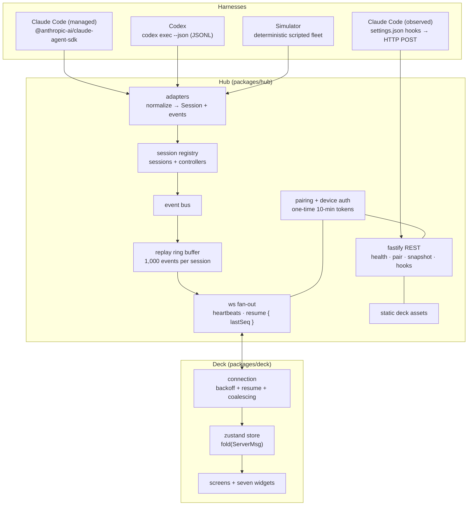

# Architecture

AgentDeck is one npm package (`agent-deck`) built from a pnpm monorepo of four
workspaces plus an E2E project. The data flow is a single direction:

## The invariants that make it feel like hardware

**One session shape.** `packages/protocol` is the single source of truth:
zod schemas for `Session`, every event kind, and both message envelopes.
Hub and deck validate at the boundary; the deck contains zero
harness-specific logic — dial detents per harness are configuration, not
code paths.

**Sequence numbers are sacred.** Every broadcast carries a hub-global,
monotonically increasing `seq`, and replayed messages keep their original
numbers. A reconnecting deck sends `lastSeq`; the hub replays the gap from
the per-session ring buffers, or sends a full-snapshot `hello` when the gap
outgrew them. The `hello.resume` field (`fresh` / `resumed` / `snapshot`)
makes the difference observable — the E2E reconnect test asserts `resumed`.

**The latency budget is enforced, not aspired to.** High-frequency inputs
(dial, jog) coalesce to one message per animation frame; grid traffic never
carries transcript bodies (those stream only to the client whose Focus view
subscribed); CI runs a loopback harness asserting p95 input→ack < 30 ms and
a 300 KB gz bundle gate.

**Adapters degrade, never crash.** `detect()` verifies real CLI flags at
startup (`claude --version`, `codex exec --help`), capabilities are
per-session flags the deck renders honestly (a Codex tile simply has no
approve key), and the shared contract suite in
`packages/hub/test/adapter-contract.ts` replays recorded fixtures so CI
needs no API keys or installed CLIs.

## Security model (SPEC §8)

- LAN-bound by default, but every WS/REST call requires a paired-device
  credential; pairing tokens are one-time and expire in 10 minutes.
- Credentials are stored sha256-hashed in `~/.agentdeck/devices.json` and
  compared timing-safe; `agentdeck devices revoke <id>` kills one device.
- `Origin` is checked at WS upgrade; pairing attempts are rate-limited.
- Claude hook POSTs are accepted from loopback only.
- `shell` actions exist only if you define them in `config.json`, and every
  invocation requires an explicit confirm tap on the deck.
- No analytics, no update phone-home, no cloud path.

## Package map

| Path                 | Role                                                                          |
| -------------------- | ----------------------------------------------------------------------------- |
| `packages/protocol`  | zod schemas + codecs; no runtime deps beyond zod                              |
| `packages/hub`       | CLI + fastify + ws; adapters under `src/adapters/`; published as `agent-deck` |
| `packages/deck`      | React 18 PWA; hand-built design system from SPEC §7 tokens                    |
| `packages/simulator` | deterministic fleet for `--demo`, E2E, screenshots                            |
| `e2e/`               | Playwright projects (iPhone 14 / iPad / desktop), latency + bundle gates      |

`@agentdeck/protocol` and `@agentdeck/simulator` are private; tsup bundles
them into the published package, and the deck's built assets ship inside
`dist/deck` so `npx agent-deck` is one artifact.
